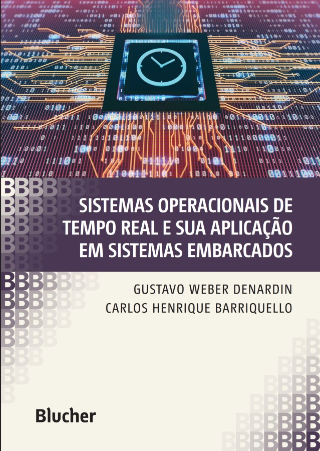

<h1 align="center">Sistemas Operacionais</h1>

<h4 align="center">Prof. Eduardo Ono</h4>

&nbsp;

| Thumb | Descrição |
| :-: | --- |
|  | [Flutterando] [__A BOLHA já estourou e ninguem percebeu__](https://www.youtube.com/watch?v=sAPjd8Y6IM8) (13:47, YouTube, Ago/2022)
|  | [Liberdade VIP] [__A Modinha PERIGOSA de Querer Ser Programador__](https://www.youtube.com/watch?v=_7ky8o7rdWI) (29:10, YouTube, Ago/2022)

&nbsp;

## Descrição

&nbsp;

## Conteúdo Programático

| Aula | Data | Conteúdo |
| :-:  | :-:  | ---      |
| 01 | 08/08 | Apresentação da Disciplina, Plano de Ensino e Critérios de Avaliação; Revisão de pré-requisitos.
| 02 | 15/08 | Conceitos de Sistema e Sistema Operacional; Tipos e Estruturas de Sistemas Operacionais; Comandos do terminal: Prompt de Comandos no Windows e Bash no Linux.
| 03 | 22/08 | [Parâmetros de um programa em C por linha de comando]; Função `atoi()`; Exemplo: Soma de dois inteiros passados pela linha de comando.
| 04 | 29/08 | Funções `atof()` e `toupper()`; Manipulação de arquivos em linguagem C; Leitura de um arquivo de texto; Funções `feof()`, `fopen()`, `fclose()`; [Exemplos de programas](./conteudo/02-cli/arquivos-em-c/).
| 05 | 05/09 | Arquivos de Lote (.bat) no Windows; Scripts em Bash no Linux; Concorrência e Paralelismo; Processos e Threads.
| 06 | 12/09 | Programação de threads em C (padrão POSIX); Região Crítica e Exclusão Mútua; Algoritmo de Peterson.
| 07 | 19/09 | Semáforos e Mutex; Algoritmo da Padaria de Lamport.
| 08 | 26/09 | __1a. Avaliação__
| 09 | 03/10 | Semana de Tecnologia e Inovação
| 10 |  | Gerenciamento de Processos; Escalonamento de Processos.
| 11 |  | Gerenciamento de Memória: Memória Principal e Secundária; Memória Virtual.
| 12 |  | Gerenciamento de Arquivos: Sistemas de Arquivos; Implementação do Sistema de Arquivos.
| 13 |  | Gerenciamento de Periféricos; Técnicas de E/S.
| 14 |  | Integridade e Segurança.

[Parâmetros de um programa em C por linha de comando]: ./conteudo/02-cli/README.md
[Manipulação de arquivos em linguagem C]: ./conteudo/02-cli/arquivos-em-c/

[01]: https://github.com/eduardo-ono/Sistemas-Operacionais/tree/master/aulas#aula-01
[02]: https://github.com/eduardo-ono/Sistemas-Operacionais/tree/master/aulas#aula-02
[03]: https://github.com/eduardo-ono/Sistemas-Operacionais/tree/master/aulas#aula-03
[04]: https://github.com/eduardo-ono/Sistemas-Operacionais/tree/master/aulas#aula-04
[05]: https://github.com/eduardo-ono/Sistemas-Operacionais/tree/master/aulas#aula-05
[06]: https://github.com/eduardo-ono/Sistemas-Operacionais/tree/master/aulas#aula-06

&nbsp;

## Recursos

* S.O. Microsoft Windows
* S.O. Ubuntu 22.04 LTS (ou outra distribuição Linux baseada no Debian)
* GCC (Compilador C/C++)
* Extensão GitHub + Mermaid (Alex Mercier) para o [Google Chrome](https://chrome.google.com/webstore/detail/github-%20-mermaid/goiiopgdnkogdbjmncgedmgpoajilohe) e [Firefox](https://addons.mozilla.org/pt-BR/firefox/addon/github-mermaid/)
* [OSDev.org](https://wiki.osdev.org/Main_Page)

&nbsp;

## Bibliografia Básica

| Capa | Título |
| :-:  | ---    |
   | [<a id="TANENBAUM-4e_2016">TANENBAUM-4e_2016</a>] TANENBAUM, Andrew. S.; BOS, Herbert. [__Sistemas Operacionais Modernos, 4. ed.__](https://archive.org/details/SistemasOperacionaisModernosTanenbaum4Edio/), São Paulo: Pearson Education do Brasil, 2016. Online: https://plataforma.bvirtual.com.br/Acervo/Publicacao/36876
   | [SILBERSCHATZ_2015] SILBERSCHATZ, Abraham; GALVIN, Peter B.; GAGNE, Greg. **Fundamentos de Sistemas Operacionais: Princípios Básicos, 9. ed.**, Rio de Janeiro: LTC, 2015.
   | [STALLINGS_2017]   STALLINGS, Willian. **Operating Systems: Internals and Design Principles, 9. ed.**, Pearson, 2017.

&nbsp;

## Bibliografia Complementar

| Capa | Título |
| :-: | --- |
|  | [DENARDIN_2019] DENARDIN, Gustavo Weber; BARRIQUELLO, Carlos Henrique;  __Sistemas Operacionais de Tempo Real e sua Aplicação em Sistemas Embarcados, 1. ed.__, São Paulo: Blucher, 2019. Online: https://plataforma.bvirtual.com.br/Acervo/Publicacao/169968
|  | [SILBERSCHATZ_2018] SILBERSCHATZ, Abraham; GALVIN, Peter B.; GAGNE, Greg; [__Operating System Concepts, 10. ed.__](https://archive.org/details/silberschatz-operating-system-concepts-10e-2018/), Wiley, 2018.
|  | [SILBERSCHATZ_2013] SILBERSCHATZ, Abraham; GALVIN, Peter B.; GAGNE, Greg. [__Operating Systems Concepts, 9. ed.__](https://archive.org/details/operating-system-concepts/), John Wiley & Sons, 2013.
|  | [TANENBAUM_2008] TANENBAUM, Andrew S.; WOODHULL, Albert S. __Sistemas Operacionais - Projeto e Implementação, 3. ed.__, 2008.
|  | [TANENBAUM_2006] TANENBAUM, Andrew S.; WOODHULL, Albert S. [__Operating Systems - Design and Implementation, 3. ed.__](https://archive.org/details/tanenbaum_woodhull_operating-systems-design-implementation-3rd-edition), Pearson Education, Inc., 2006.
|  |  [STUART_2011] STUART, Brian L. __Princípios de Sistemas Operacionais - Projetos e Aplicações__, São Paulo: Cengage Learning, 2011.
|  | [MACHADO_2007] MACHADO, Francis B.; MAIA, Luiz P. __Arquitetura de Sistemas Operacionais, 4. ed.__, Rio de Janeiro: LTC, 2007.

  * https://goalkicker.com/LinuxBook/

  * https://goalkicker.com/BashBook/

&nbsp;

## Vídeos Recomendados

| Thumb | Descrição |
| :-: | --- |
|  | [MIT Video Productions] [Steve Jobs President & CEO, NeXT Computer Corp and Apple. MIT Sloan Distinguished Speaker Series](https://www.youtube.com/watch?v=Gk-9Fd2mEnI) (1:12:53, YouTube, Dez/2017)
|  | [60 second] [Um grupo de cinco macacos e dois cientistas](https://www.youtube.com/watch?v=ZAQtwFpkksw) (1:50, YouTube, Fev/2013)

&nbsp;

## Filmes e Documentários Recomendados

| Thumb | Descrição |
| :-: | --- |
|  | __Jobs__ (2013)
|  | __Steve Jobs__ (2015)
|  | __Ghost in the Shell__ (2017)
|  | [Apple Explained] __History of Steve Jobs (Full Documentary)__ (1:06:03, YouTube, Mar/2021)
|  | [Aulas de Computação] [__Von Neumann - Um gênio maior que Albert Einstein? Biografia/História #6__](https://www.youtube.com/watch?v=fU88KquvAts) (19:52, YouTube, Nov/2021)

&nbsp;

| Windows 11 | Vídeos |
| --- | --- |
| __Instalação__ |  &nbsp; 
| __WSL__ |  &nbsp; 
| __Novidades__ |  &nbsp;  &nbsp; : biggest new features and changes, so far \|\| 24:20, YouTube, Jun/2021") &nbsp; 

&nbsp;
