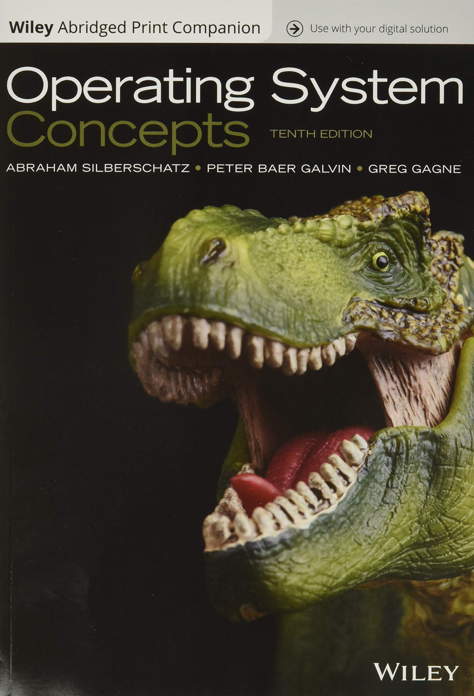

 # Sistemas Operacionais

Prof. Eduardo Ono

 

## Descrição

| [: biggest new features and changes, so far \|\| 24:20, YouTube, Jun/2021")](https://www.youtube.com/watch?v=_uVe3pU9yhw) |
| --- |

 

## Conteúdo Programático

| Aula | Data | Conteúdo |
| :-:  | :-:  | ---      |
| 01 | 23/02 | Apresentação da Disciplina, Plano de Ensino e Critérios de Avaliação, Revisão de pré-requisitos
| 02 | 02/03 | Conceitos de Sistema e Sistema Operacional, Tipos e Estruturas de Sistemas Operacionais; Comandos do Bash (Terminal Linux); Prompt de Comando (Windows)
| 03 | 09/03 | Parâmetros de um programa em C por linha de comando; Arquivos de Lote (.bat) no Windows; Scripts em Bash no Linux
| 04 | 16/03 | Concorrência e Paralelismo; Processos e Threads
| 05 | 23/03 | Threads em Linguagem C (POSIX)
| 06 | 30/03 | Região Crítica e Exclusão Mútua
| 07 | 06/04 | Semáforos e Mutex
| 08 | 13/04 | Algoritmo da Padaria de Lamport
| 09 | 20/04 | Problemas Clássicos de Sincronização; __1a. Avaliação__
| 10 | 27/04 | Escalonamento de Processos;
| 11 | 04/05 | Gerenciamento de Memória: Memória Principal e Secundária
| 12 | 11/05 | Gerenciamento de Memória: Memória Virtual
| 13 | 18/05 | Gerenciamento de Arquivos: Sistemas de Arquivos; Implementação do Sistema de Arquivos
| 14 | 25/05 | Gerenciamento de Periféricos; Técnicas de E/S
| 15 | 01/06 | Integridade e Segurança
| -- | 08/06 | Revisão do conteúdo; __2a. Avaliação__

 

## Recursos

* S.O. Microsoft Windows
* S.O. Ubuntu 20.04 (ou outra distribuição Linux baseada no Debian)
  * [Instalação do Ubuntu 20.04 LTS junto ao Windows 10](./conteudo/ambiente-de-desenvolvimento/README.md#ubuntu)
* GCC (Compilador C/C++)
* Extensão GitHub + Mermaid (Alex Mercier) para o Google Chrome e [Firefox](https://addons.mozilla.org/pt-BR/firefox/addon/github-mermaid/)
* [OSDev.org](https://wiki.osdev.org/Main_Page)

 

## Bibliografia Básica

| Capa | Título |
| :-:  | ---    |
   | [<a id="TANENBAUM-4e_2016">TANENBAUM-4e_2016</a>]   TANENBAUM, Andrew. S.; BOS, Herbert. [__Sistemas Operacionais Modernos, 4. ed.__](https://archive.org/details/SistemasOperacionaisModernosTanenbaum4Edio/), São Paulo: Pearson Education do Brasil, 2016.
   | [SILBERSCHATZ_2015]   SILBERSCHATZ, Abraham; GALVIN, Peter B.; GAGNE, Greg. **Fundamentos de Sistemas Operacionais: Princípios Básicos, 9. ed.**, Rio de Janeiro: LTC, 2015.
   | [STALLINGS_2017]   STALLINGS, Willian. **Operating Systems: Internals and Design Principles, 9. ed.**, Pearson, 2017.

 

## Bibliografia Complementar

| Capa | Título |
| :-:  | ---    |
|   | [SILBERSCHATZ_2018] SILBERSCHATZ, Abraham; GALVIN, Peter B.; GAGNE, Greg; [**Operating System Concepts, 10. ed.**](https://archive.org/details/silberschatz-operating-system-concepts-10e-2018/), Wiley, 2018.
   | [SILBERSCHATZ_2013] SILBERSCHATZ, Abraham; GALVIN, Peter B.; GAGNE, Greg. [**Operating Systems Concepts, 9. ed.**](https://archive.org/details/operating-system-concepts/), John Wiley & Sons, 2013.
   | [TANENBAUM_2008] TANENBAUM, Andrew S.; WOODHULL, Albert S. **Sistemas Operacionais - Projeto e Implementação, 3. ed.**, 2008.
   | [TANENBAUM_2006] TANENBAUM, Andrew S.; WOODHULL, Albert S. [**Operating Systems - Design and Implementation, 3. ed.**](https://archive.org/details/tanenbaum_woodhull_operating-systems-design-implementation-3rd-edition), Pearson Education, Inc., 2006.
   |  [STUART_2011] STUART, Brian L. __Princípios de Sistemas Operacionais - Projetos e Aplicações__, São Paulo: Cengage Learning, 2011.
   | [MACHADO_2007] MACHADO, Francis B.; MAIA, Luiz P. **Arquitetura de Sistemas Operacionais, 4. ed.**, Rio de Janeiro: LTC, 2007.

  * https://goalkicker.com/LinuxBook/

  * https://goalkicker.com/BashBook/

 

## Filmes e Documentários Recomendados

|| Descrição |
| :-: | --- |
|  | Jobs (2013)
|  | Steve Jobs (2015)
|  | History of Steve Jobs (Full Documentary) \|\| 1:06:03, YouTube, Mar/2021.

 

## Vídeos Recomendados

|| Descrição |
| :-: | --- |
|  | [60 second] [Um grupo de cinco macacos e dois cientistas](https://www.youtube.com/watch?v=ZAQtwFpkksw) \|\| 1:50, YouTube.

 
