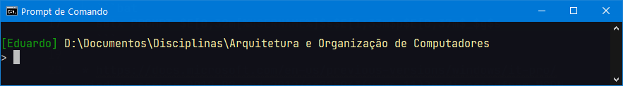

> Sistemas Operacionais > Conteúdo > CLI - Windows

# Prompt de Comando

Prof. Eduardo Ono

<br>

## Configuração do prompt de Comando

* Exemplo com duas linhas

  ```bat
  setx PROMPT $E[0;32m[%USERNAME%]$s$E[1;33m$p$E[0;37m$_$g$s
  ```

  

* https://docs.microsoft.com/en-us/previous-versions/windows/it-pro/windows-server-2012-R2-and-2012/cc725943(v=ws.11)?redirectedfrom=MSDN

<br>

### Tabela de Cores

| Valor | Atributos de texto |
| :-: | --- |
| 0 | All attributes off
| 1 | Bold on
| 4 | Underscore (on monochrome display adapter only)
| 5 | Blink on
| 7 | Reverse video on
| 8 | Concealed on

| Valor | Foreground colors | Valor | Background colors |
| :-: | --- | :-: | --- |
| 30 | Black   | 40 | Black
| 31 | Red     | 41 | Red
| 32 | Green   | 42 | Green
| 33 | Yellow  | 43 | Yellow
| 34 | Blue    | 44 | Blue
| 35 | Magenta | 45 | Magenta
| 36 | Cyan    | 46 | Cyan
| 37 | White   | 47 | White

<br>
