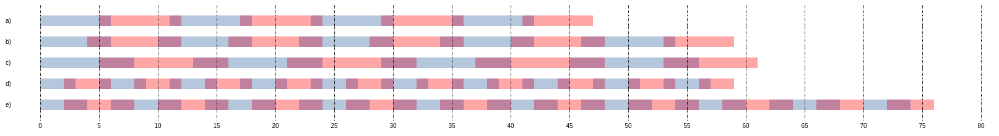

> ### Sistemas Operacionais > Conteúdo > [Escalonamento de Processos](../escalonamento-de-processos/README.md)

# Round-Robin (Turno Rotativo ou Circular)

Prof. Eduardo Ono

 

## Referências

* [[TANENBAUM-4e_2016]] Cap. 2, pp. 109-110.

 

## Características

* Classificação: Preemptivo
* A lista de processos é implementada como uma fila circular.
* Quantum: tempo máximo no qual um processo pode utilizar a CPU ininterruptamente. Tem por objetivo evitar o monopólio da CPU por um único processo.

 

## Exemplos

 

## Vídeos de Apoio

|| Descrição |
| :-: | --- |
|  | [UNIVESP]   [**Sistemas Operacionais – Aula 06 - Escalonamento de Processo**](https://www.youtube.com/watch?v=MWbPgxOCrFk) \|\| 25:52, YouTube, Mai/2017.

 

## Exercícios Resolvidos

1. [ENADE-2019_Eng-Computação (adaptado)] Suponha que um Sistema Operacional utilize o algoritmo _Round-Robin_ de escalonamento e precise executar dois processos, ambos com tempo de tarefa de 20 ms. Objetivando-se minimizar o tempo de resposta do sistema, determine o _quantum_ e o tempo de troca de contexto, respectivamente, dentre as alternativas apresentadas a seguir:

  * a) [x] 5 ms e 1 ms.
  * b) [ ] 4 ms e 2 ms.
  * c) [ ] 5 ms e 3 ms.
  * d) [ ] 2 ms e 1 ms.
  * e) [ ] 2 ms e 2 ms.

    Resp.:
    
    

 

---

1. [[Daniel Silos, YouTube](https://www.youtube.com/watch?v=_iBmD3neoog)] O escalonamento de CPU trata do problema de decidir qual dos processos na fila de prontos deve ser entregue à CPU. Considere que o algoritmo de escalonamento de Round-Robin esteja sendo utilizado e que o conjunto de processos abaixo chegue no momento zero, com a extensão do tempo de _burst_ de CPU indicada em milissegundos. Dado: P1 é o primeiro processo na fila de prontos, P2 é o segundo, P3 é o terceiro e P4 é o quarto.

| Processo | Tempo de Execução (ms) |
| :-: | :-: |
| P1 | 15 |
| P2 |  5 |
| P3 |  6 |
| P4 |  5 |

Se for utilizado um quantum (_time-slice_) de 5 ms, o __tempo de espera médio__ será de:

* a) [ ] 11
* b) [ ] 12
* c) [ ] 13
* d) [x] 14
* e) [ ] 15

 

Resp.:

|        |        |        |        |        |     |        |
| ---    | ---    | ---    | ---    | ---    | --- | ---    |
| ##P1## |        |        |        |        |     |        |
|        | ##P2## |
|        |        | ##P3## |
|        |        |        | ##P4## |
|        |        |        |        | ##P1## |
|        |        |        |        |        | P3  |
|        |        |        |        |        |     | ##P1## |

_T_ esp.P1 = 31 - 15 = 16  
_T_ esp.P2 = 10 - 5 = 5  
_T_ esp.P3 = 26 - 6 = 20  
_T_ esp.P4 = 20 - 5 = 15   

_T_ médio esp. = (16 + 5 + 20 + 15) / 4 = 14

 

---

1. Suponha os processos A, B, C, e D com tempos de chegada (Arrival Time - AT) e duração de cada processo (Processing Time - PT) conforme a tabela a seguir:

    | Processo | AT | PT |
    | :-: | :-: | :-: |
    | A |  0 |  8 |
    | B |  1 |  5 |
    | C |  3 |  1 |
    | D |  6 |  4 |

    Determine o tempo de espera médio na execução dos processos.

    Resp.: 

    Sequência de execução:

    | A(2) | B(2) | A(2) | C(1) | B(2) | D(2) | A(2) | B(1) | D(2) | A(2) |
    | ---  | ---  | ---  | ---  | ---  | ---  | ---  | ---  | ---  | ---  |

    _t_esp.(A) = 18 - 8 = 10 ms  
    _t_esp.(B) = 14 - 1 - 5 = 8 ms  
    _t_esp.(C) = 7 - 3 - 1 = 3 ms  
    _t_esp.(D) = 16 - 6 - 4 = 6 ms  

    tmédio execução = (10 + 8 + 3 + 6) / 4 = 6,75 ms

 

---

__Ignorar o restante (em elaboração)__

1.

WT = Tempo de espera (Waiting Time)
TT = Tempo total de execução (Turnaround Time)

|     | AT  | PT  | WT  |  TT |
| :-- | :-: | :-: | :-: | :-: |
| P1  |  0  | 10  |  0  |
| P2  |  0  |  5  |  5  |
| P3  |  4  |  8  |
| P4  | 10  |  3  |

| P1(5) | P2(5) |

 

[TANENBAUM-4e_2016]: /referencias/README.md#TANENBAUM-4e_2016
