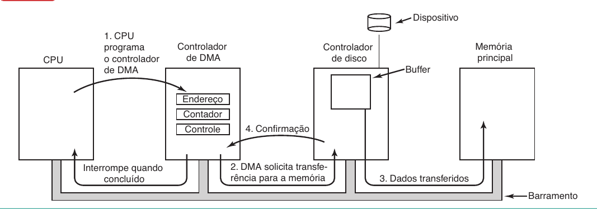

> #### Sistemas Operacionais > Conteúdo

# Gerenciamento de Periféricos (E/S)

Prof. Eduardo Ono

 

## Princípios de Hardware de E/S

### Dispositivos de E/S

  * Ref.:
    * 

  * Categorias

    * Dispositivos de blocos
      * Armazena informações em blocos de tamanho fixo, cada um com seu próprio endereço. Tamanhos comuns de blocos variam de 512 a 65.536 bytes.
      * Exemplos
        * Discos rígidos, discos óticos (CD, DVD, Blu-ray) e pendrives.

    * Dispositivos de caractere
      * Envia ou aceita um fluxo de caracteres, desconsiderando qualquer estrutura de bloco. Não é endereçável e não tem qualquer operação de busca.
      * Exemplos
        *  Impressoras, interfaces de rede e mouses.

  * Controladores de dispositivos

    * Exemplos
      Controlador de disco

  * E/S mapeada na memória

    * Cada controlador tem alguns registradores que são usados para comunicar-se com a CPU. Ao escrever nesses registradores, o sistema operacional pode comandar o dispositivo a fornecer e aceitar dados, ligar-se e desligar-se, ou de outra maneira realizar alguma ação.
    
    * Além dos registradores de controle, muitos dispositivos têm um buffer de dados a partir do qual o sistema operacional pode ler e escrever.

  * Interrupções

    * Exemplos
      * Mouse e teclado

### Acesso Direto à Memória (DMA)

  * Não importa onde esteja localizado fisicamente, o controlador de DMA tem acesso ao barramento do sistema independente da CPU.

  

 

## Princípios de Software de E/S

### Objetivos principais

* Independência de dispositivo
  * Programas devem acessar qualquer dispositivo de E/S sem ter de especificá-lo antecipadamente.

* Nomeação uniforme
  *  O nome de um arquivo ou um dispositivo deve simplesmente ser uma cadeia de caracteres ou um número inteiro e não depender do dispositivo de maneira alguma.

### Modes de operação de E/S

* E/S programada

* E/S via interrupções

* E/S via acesso direto à memória (DMA)

 

## Camadas do Software de E/S

* Ref.:
  * [[TANENBAUM-4e_2016]], Cap. 5, pp. 246-255.

||
| :-: |
| Software de E/S no nível do usuário |
| Software do sistema operacional independente do dispositivo |
| Drivers do dispositivo |
| Tratadores de interrupção |
| __Hardware__ |

 

[TANENBAUM-4e_2016]: ../../README.md#TANENBAUM-4e_2016
