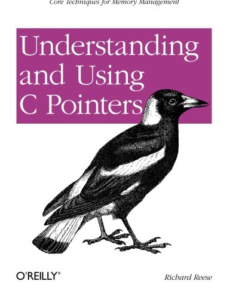

### Sistemas Operacionais

# Referências Bibliográficas

Prof. Eduardo Ono

 

| Capa | Título |
| :-:  | ---    |
|  | 
[REESE_2013] REESE, Richard. **Understanding and Using C Pointers**, O'Reilly Media, 2013[.](https://app.box.com/s/cbp98oofhokip0yki3gh7khz6zb6htgq)

 
